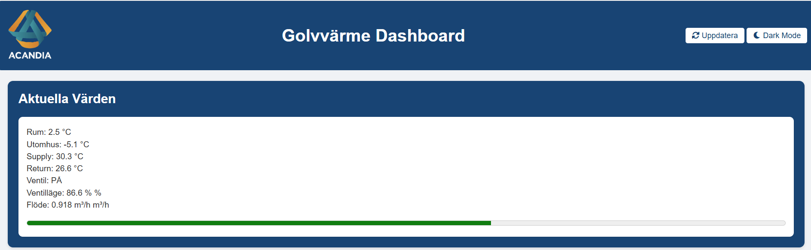
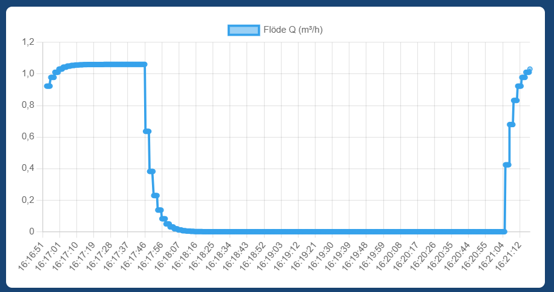
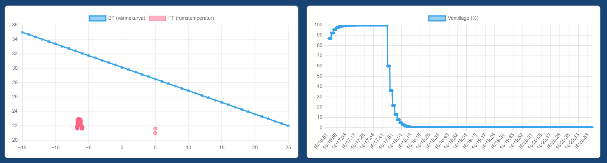
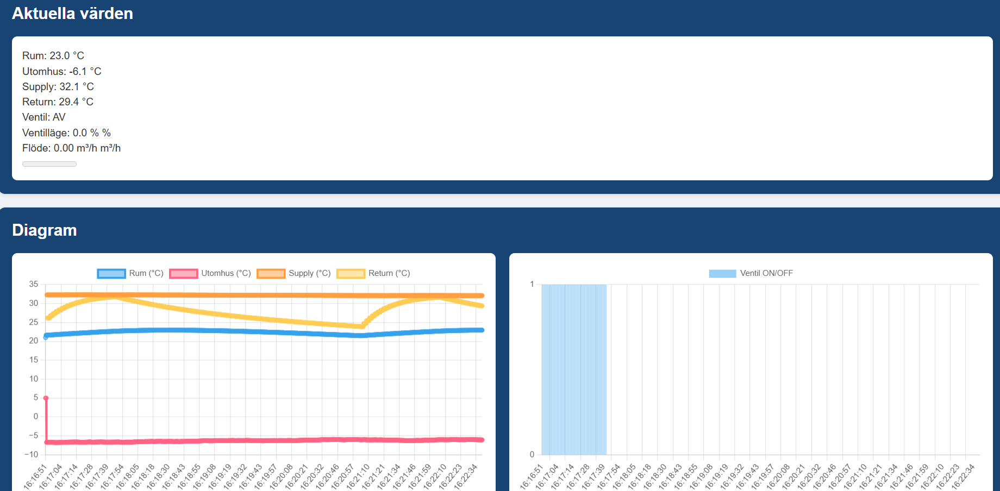

# Golvvärme Dashboard Portfolio

## Projektöversikt

Golvvärme Dashboard-projektet är en omfattande IoT-lösning för övervakning och styrning av golvvärmesystem. Det integrerar en PID-regulator för effektiv temperaturreglering, differentialekvationer för noggrann flödesimulering och ett användarvänligt gränssnitt för realtidsdata. Detta projekt adresserar begränsningarna i traditionella golvvärmesystem genom att erbjuda exakt temperaturkontroll, minskad energiförbrukning och ökad komfort. Projektet är ett Proof of Concept (PoC) och använder simulerade sensordata för demonstrationsändamål.

### Nyckelfunktioner

* Realtidsövervakning av temperatur och flöde
* Avancerad PID-baserad kontroll för optimal värmefördelning
* Interaktiv datavisualisering genom anpassade dashboards
* MQTT-baserad kommunikation för flexibel integration

## Systemarkitektur

Systemet är uppbyggt kring tre huvudkomponenter:

1. **Sensorlager:** Innehåller sensorer för inomhus- och utomhustemperatur samt vattentemperatur för tillopp och retur. Dessa sensorer tillhandahåller den kritiska data som krävs för effektiv PID-styrning.

2. **Simulator:** Denna komponent inkluderar en PID-regulator och en ventilmodell för att simulera vattenflödesdynamik baserat på differentialekvationer.

3. **Dashboard-gränssnitt:** Ett webbaserat användargränssnitt byggt med Flask, Chart.js och anpassad CSS för realtidsvisualisering av data.

## Så Fungerar Det

Systemet använder en PID-regulator för att upprätthålla målrummets temperatur genom att justera vattenflödet i golvvärmeslingorna. Det tar hänsyn till utomhustemperaturen för att optimera tilloppstemperaturen, vilket säkerställer komfort samtidigt som energiförbrukningen minimeras.

### PID-kontroll

En PID (Proportionell-Integrerande-Deriverande) regulator beräknar kontinuerligt ett felvärde som skillnaden mellan ett önskat börvärde och den uppmätta processen (rumstemperatur). Den försöker korrigera felet med tre termer:

* **Proportionell (P):** Reagerar på det aktuella felet
* **Integrerande (I):** Tar hänsyn till tidigare fel
* **Deriverande (D):** Förutser framtida fel

Denna kombination resulterar i mjuk och exakt temperaturkontroll.

### Differentialekvationer

Systemet simulerar vattenflödet med följande ekvation:

$$
Q = K_v \cdot x \cdot \sqrt{\Delta P}
$$

där:

* $Q$ = Flödeshastighet
* $K_v$ = Flödeskoefficient (beroende av ventilposition)
* $x$ = Ventilposition (0-1)
* $\Delta P$ = Tryckdifferens över ventilen

Denna metod säkerställer realistisk simulering av termodynamik och energiflöde.

## Dashboard-gränssnitt

Dashboarden ger en omfattande vy över golvvärmesystemets nuvarande status, inklusive:

### Aktuella Värden

### Vattenflödesgraf

### Värmekurva och Ventilläge

### Temperatur och Ventilstatus

## Utmaningar med Traditionella Golvvärmesystem

Traditionella golvvärmesystem lider ofta av långsamma responstider och ineffektiv temperaturreglering på grund av den höga termiska massan i betongplattor. Detta projekt adresserar dessa utmaningar genom att använda realtidsdata och intelligenta styralgoritmer för att optimera värmefördelningen.

## Framtida Förbättringar

* Integration med smarta termostater och hemautomationssystem
* Maskininlärning för adaptiv temperaturkontroll
* Prediktivt underhåll och avvikelsedetektering

## Slutsats

Detta projekt demonstrerar potentialen för IoT och avancerade styralgoritmer för att avsevärt förbättra prestanda och energieffektivitet hos golvvärmesystem. Den modulära designen möjliggör framtida expansion och integration med andra smarta hemteknologier.
