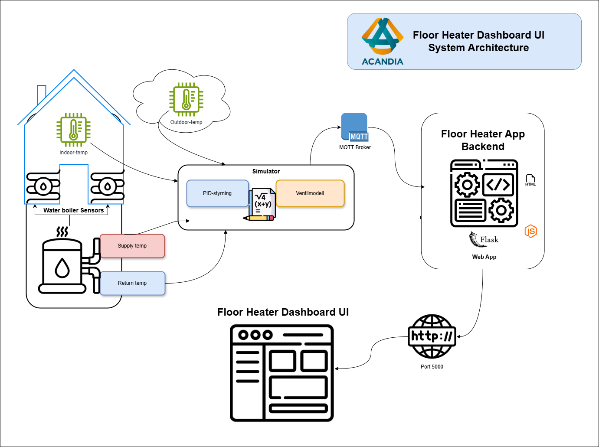

# Golvvärme System Portfolio

## Systemöversikt

Golvvärmesystemet är utformat för att simulera, styra och övervaka inomhustemperatur genom att justera vattentemperaturen i ett golvvärmesystem. Projektet inkluderar en PID-kontroller för att bibehålla önskad rumstemperatur och en ventilmodell för att reglera flödet av varmvatten beroende på utomhustemperaturen. Systemet använder en Flask-baserad backend för datahantering och visualisering samt en MQTT-broker för realtidskommunikation mellan simulering och användargränssnitt.

### Systemarkitektur

Systemet består av följande huvudkomponenter:

* **PID-styrning:** Justerar vattentemperaturen baserat på inomhustemperatur och värmekurva.
* **Ventilmodell:** Hanterar ventilens öppning för att reglera vattenflödet beroende på tryck och temperatur.
* **MQTT-broker:** Överför sensordata och styrsignaler mellan simulatorn och backend.
* **Flask Backend:** Hanterar användargränssnitt, datauppdateringar och kommunikation med MQTT.
* **Dashboard UI:** Visar aktuell status och historik över temperaturer och ventillägen.

## PID-styrning och ventilmodell

PID-kontrollern används för att justera vattentemperaturen för att nå önskad rumstemperatur baserat på en värmekurva eller ett fast börvärde. Detta regleras med hjälp av proportional (P), integrerande (I) och deriverande (D) komponenter:

$u(t) = K_p \cdot e(t) + K_i \cdot \int e(t)dt + K_d \cdot \frac{de(t)}{dt}$

Ventilmodellen reglerar flödet beroende på ventilens öppningsgrad (x) och tryckdifferens (dp):

$Q = Kv \cdot x \cdot \sqrt{dp}$

Denna modell tar hänsyn till ventilens tröghet och dynamiska beteende för att simulera verkliga förhållanden.

## Systemproblem och lösningar

Vanliga problem med traditionella golvvärmesystem inkluderar:

* **Temperaturöverskott:** Fördröjningar i styrsystemet kan orsaka överhettning.
* **Energislöseri:** Ineffektiv temperaturreglering kan leda till högre energiförbrukning.
* **Långsam respons:** Golvvärmesystem reagerar långsamt på temperaturändringar.

Genom att använda en PID-kontroller och en ventilmodell kan dessa problem minskas genom bättre prediktion av värmebehov och snabbare justeringar.

## Skärmbilder och demonstration

### Översikt

### Aktuella värden

### Vattenflödesgraf

### Värmekurva och ventilläge

### Temperatur och ventilstatus

## Framtida förbättringar

Några möjliga förbättringar för framtida versioner:

* Anpassning av PID-parametrar för olika rum och byggnadstyper.
* Lägga till ML-algoritmer för bättre värmeprognoser.
* Optimerad energianvändning genom adaptiva värmekurvor.

Tack för att du tittade på detta projekt! Jag ser fram emot att vidareutveckla detta system och utforska nya sätt att förbättra energieffektiviteten i moderna byggnader.
