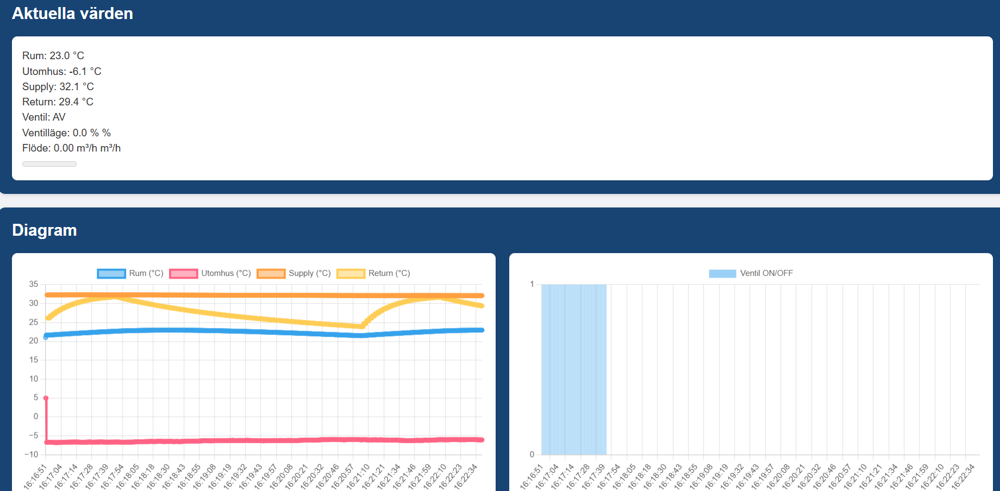

# Floor Heater Dashboard Portfolio

## Project Overview

The Floor Heater Dashboard project is a comprehensive IoT solution for monitoring and controlling floor heating systems. It integrates a PID controller for efficient temperature regulation, differential equations for accurate flow simulation, and a user-friendly dashboard for real-time data visualization. This project addresses the limitations of conventional floor heating systems by providing precise temperature control, reduced energy consumption, and enhanced comfort. This project is a Proof of Concept (PoC) and uses simulated sensor data for demonstration purposes.

### Key Features

* Real-time temperature and flow monitoring
* Advanced PID-based control for optimal heat distribution
* Interactive data visualization through custom dashboards
* MQTT-based communication for flexible integration

## System Architecture

The system is structured around three main components:

1. **Sensor Layer:** Includes indoor and outdoor temperature sensors, water supply, and return temperature sensors. These sensors provide the critical data needed for efficient PID control.

2. **Simulator:** This component includes a PID controller and a valve model for simulating water flow dynamics based on differential equations.

3. **Dashboard Interface:** A web-based UI built with Flask, Chart.js, and custom CSS for real-time data visualization.

## How It Works

The system uses a PID controller to maintain the target room temperature by adjusting the water flow through the floor heating pipes. It takes into account the outdoor temperature to optimize the supply temperature, ensuring comfort while minimizing energy consumption.

### PID Control

A PID (Proportional-Integral-Derivative) controller continuously calculates an error value as the difference between a desired setpoint and the measured process variable (room temperature). It attempts to correct the error using three terms:

* **Proportional (P):** Reacts to the current error
* **Integral (I):** Accounts for past errors
* **Derivative (D):** Predicts future errors

This combination results in smooth and accurate temperature control.

### Differential Equations

The system simulates water flow using the equation:

\$Q = K\_v \cdot x \cdot \sqrt{\Delta P}\$

where:

* \$Q\$ = Flow rate
* \$K\_v\$ = Flow coefficient (ventil position dependent)
* \$x\$ = Valve position (0-1)
* \$\Delta P\$ = Pressure differential across the valve

This approach ensures realistic simulation of thermal dynamics and energy flow.

## Dashboard Interface

The dashboard provides a comprehensive view of the floor heating system's current state, including:

### Current Values

### Water Flow Graph

### Warming Curve and Valve Position

### Temperature and Valve State Graph

## Challenges in Conventional Floor Heating

Traditional floor heating systems often suffer from slow response times and inefficient temperature regulation due to the high thermal mass of concrete slabs. This project addresses these challenges by using real-time data and intelligent control algorithms to optimize heat distribution.

## Future Improvements

* Integration with smart thermostats and home automation systems
* Machine learning for adaptive temperature control
* Predictive maintenance and anomaly detection

## Conclusion

This project demonstrates the potential for IoT and advanced control algorithms to significantly improve the performance and energy efficiency of floor heating systems. The modular design allows for future expansion and integration with other smart home technologies.
