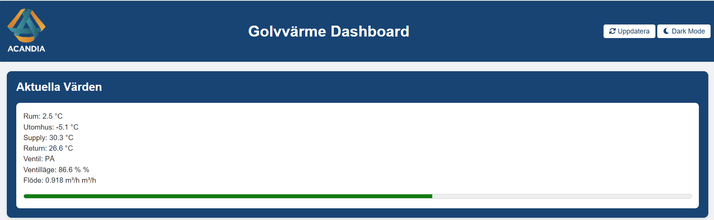
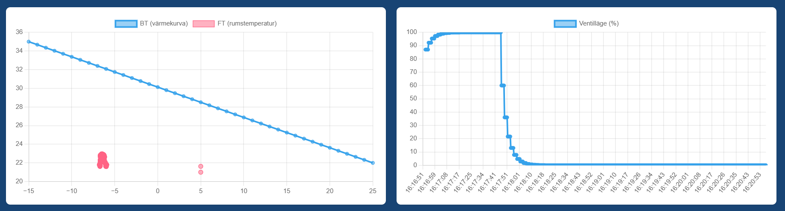

# Golvvärme Projekt Portfolio

## Introduktion

Detta projekt är ett system för styrning och övervakning av golvvärme, designat för att förbättra energieffektiviteten och ge användaren bättre kontroll över uppvärmningen. Systemet inkluderar en avancerad simulator som hanterar ventildynamik och temperaturreglering genom en PID-kontroller. Målet är att simulera realistiska golvvärmesystem och ge användaren en tydlig översikt av aktuella värden och historiska data.

## Systemarkitektur

Systemet är uppdelat i flera komponenter, inklusive:

* **Sensornoder**: Mäter inomhus- och utomhustemperatur samt vattenflöde.
* **Simulator**: Hanterar PID-styrning och ventildynamik för att reglera vattenflödet baserat på aktuell rumstemperatur.
* **MQTT Broker**: Används för att skicka mätdata mellan simulatorn och backend-applikationen.
* **Backend (Flask)**: En Flask-baserad webbapplikation som hanterar grafer och användargränssnitt.
* **Webbgränssnitt**: En användarvänlig dashboard för att visualisera temperaturdata och styra systemet.

## PID-reglering

PID-kontrollern används för att justera vattentemperaturen och ventilens position för att hålla rumstemperaturen inom önskat område. PID-algoritmen beräknar det nödvändiga justeringen baserat på felet mellan den faktiska och önskade rumstemperaturen. Detta görs genom att ta hänsyn till proportionell, integrerad och deriverad del av felet.

## Grafiska Komponenter

Systemet inkluderar flera olika grafer och visualiseringar:

* **Aktuella Värden** - Visar realtidsdata för rumstemperatur, utomhustemperatur, vattentemperatur, ventilposition och flöde.

* **Värmekurva och Ventilläge** - Visar förhållandet mellan utomhustemperatur och önskad vattentemperatur samt ventilens position.

* **Vattenflöde** - Graf över vattenflödet genom systemet.

## Utmaningar med Traditionella Golvvärmesystem

Traditionella golvvärmesystem lider ofta av ineffektiv reglering på grund av långa svarstider och brist på intelligent styrning. Detta projekt försöker lösa dessa problem genom att använda modern PID-styrning och simulering för att bättre förutsäga värmebehovet baserat på utomhustemperaturen.

## Sammanfattning

Detta golvvärmesystem är ett utmärkt exempel på hur avancerad styrning och simulering kan förbättra energieffektiviteten och användarupplevelsen i moderna byggnader. Projektet erbjuder en flexibel plattform för framtida utveckling och anpassning beroende på användarens behov.

## Framtida Utveckling

* Stöd för flera rum och zoner.
* Integration med smarta hem-system.
* Förbättrad användargränssnitt och fler grafer för analys.
